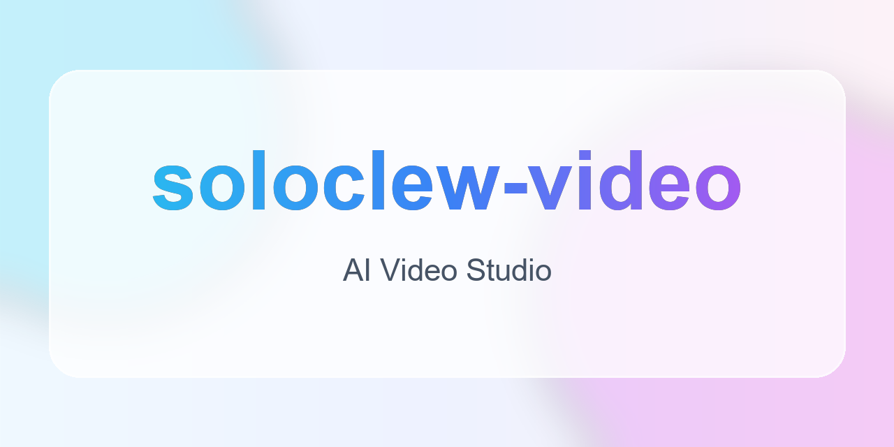

<p align="center">
  <a href="https://github.com/wangjunhaoo/ai-shortvideo">
    
  </a>
</p>

<p align="center">
  
</p>

<h1 align="center">soloclew-video AI 影视 Studio</h1>

<p align="center">
  一款基于 AI 技术的短剧/漫画视频制作工具，支持从小说文本自动生成分镜、角色、场景，并制作成完整视频。
</p>

<p align="center">
  <a href="README_en.md">English</a> · <a href="https://github.com/wangjunhaoo/ai-shortvideo">GitHub 仓库</a> · <a href="https://github.com/wangjunhaoo/ai-shortvideo/issues">反馈问题</a>
</p>

> [!IMPORTANT]
> ⚠️ **测试版声明**：本项目目前处于测试初期阶段，由于暂时只有我一个人开发，存在部分 bug 和不完善之处。我们正在快速迭代更新中，**欢迎进群反馈问题和需求，及时关注项目更新！目前更新会非常频繁，后续会增加大量新功能以及优化效果，我们的目标是成为行业最强AI工具！**


---

## ✨ 功能特性

- 🎬 **AI 剧本分析** — 自动解析小说，提取角色、场景、剧情
- 🎨 **角色 & 场景生成** — AI 生成一致性人物和场景图片
- 📽️ **分镜视频制作** — 自动生成分镜头并合成视频
- 🎙️ **AI 配音** — 多角色语音合成
- 🌐 **多语言支持** — 中文 / 英文界面，右上角一键切换

---

## 🚀 快速开始

### Windows / macOS 桌面版（推荐普通用户）

> 当前仓库已提供桌面端打包链路（Electron + electron-builder）。  
> Windows 产出 `Setup.exe`，macOS 产出 `.dmg` / `.zip`，普通用户无需 Docker / Node.js。

如果你是维护者，发布桌面安装包步骤如下：

```bash
# 1) 生成 sqlite schema + prisma client + web 构建
npm run desktop:prepare

# 2) （仅 Windows）下载 redis-server.exe 到打包目录
npm run desktop:sync:redis:win

# 3) 产出 Windows 安装包
npm run desktop:pack

# 4) 在 macOS 机器上产出 macOS 安装包
npm run desktop:pack:mac
```

> ⚠️ macOS 安装包必须在 macOS 环境中构建；Windows CI 不能直接产出可发布的 `.dmg` / `.zip`。

CI 已新增 Windows / macOS 构建工作流：`.github/workflows/desktop-windows.yml`、`.github/workflows/desktop-macos.yml`。  
打 tag（`v*`）后会自动生成并上传桌面安装包资产。

---

**前提条件**：安装 [Docker Desktop](https://docs.docker.com/get-docker/)

### 方式一：拉取预构建镜像（最简单）

无需克隆仓库，下载即用：

```bash
# 下载 docker-compose.yml
curl -O https://raw.githubusercontent.com/wangjunhaoo/ai-shortvideo/main/docker-compose.yml

# 启动所有服务
docker compose up -d
```

> ⚠️ 当前为测试版，版本间数据库不兼容。升级请先清除旧数据：

```bash
docker compose down -v
docker compose pull
curl -O https://raw.githubusercontent.com/wangjunhaoo/ai-shortvideo/main/docker-compose.yml
docker compose up -d
```

> 启动后请**清空浏览器缓存**并重新登录，避免旧版本缓存导致异常。

### 方式二：克隆仓库 + Docker 构建（完全控制）

```bash
git clone https://github.com/wangjunhaoo/ai-shortvideo.git
cd ai-shortvideo
docker compose up -d
```

更新版本：
```bash
git pull
docker compose down && docker compose up -d --build
```

### 方式三：本地开发模式（开发者）

```bash
git clone https://github.com/wangjunhaoo/ai-shortvideo.git
cd ai-shortvideo

# 复制环境变量配置文件（必须在 npm install 之前完成）
cp .env.example .env
# ⚠️ 编辑 .env，填入你的 AI API Key（NEXTAUTH_URL 默认已是 http://localhost:3000，无需修改）

npm install

# 只启动基础设施
# 注意：docker-compose.yml 将服务映射到非标准端口，.env.example 已按此预设
mysql:13306  redis:16379  minio:19000
docker compose up mysql redis minio -d

# 初始化数据库表结构（首次必须执行，跳过会导致启动后报错）
npx prisma db push

# 启动开发服务器
npm run dev
```

> [!WARNING]
> 跳过 `npx prisma db push` 会导致所有数据库表不存在，启动后报错 `The table 'tasks' does not exist`。请务必先运行此命令再启动开发服务器。

---

访问 [http://localhost:13000](http://localhost:13000)（方式一、二）或 [http://localhost:3000](http://localhost:3000)（方式三）开始使用！

> 首次启动会自动完成数据库初始化，无需任何额外配置。

> [!TIP]
> **如果遇到网页卡顿**：HTTP 模式下浏览器可能限制并发连接。可安装 [Caddy](https://caddyserver.com/docs/install) 启用 HTTPS：
> ```bash
> caddy run --config Caddyfile
> ```
> 然后访问 [https://localhost:1443](https://localhost:1443)

---

## 🔧 API 配置

启动后进入**设置中心**配置 AI 服务的 API Key，内置配置教程。

> 💡 **注意**：目前仅推荐使用各服务商官方 API，第三方兼容格式（OpenAI Compatible）尚不完善，后续版本会持续优化。

---

## 📦 技术栈

- **框架**: Next.js 15 + React 19
- **数据库**: MySQL + Prisma ORM
- **队列**: Redis + BullMQ
- **样式**: Tailwind CSS v4
- **认证**: NextAuth.js

---

## 📦 页面功能预览


---

## 🤝 参与方式

本项目由核心团队独立维护。欢迎你通过以下方式参与：

- 🐛 提交 [Issue](https://github.com/wangjunhaoo/ai-shortvideo/issues) 反馈 Bug
- 💡 提交 [Issue](https://github.com/wangjunhaoo/ai-shortvideo/issues) 提出功能建议
- 🔧 提交 Pull Request 供参考 — 我们会认真审阅每一个 PR 的思路，但最终由团队自行实现修复，不会直接合并外部 PR

---

**Made with ❤️ by soloclew-video team**

## Star History

[](https://www.star-history.com/#wangjunhaoo/ai-shortvideo&type=date&legend=top-left)
